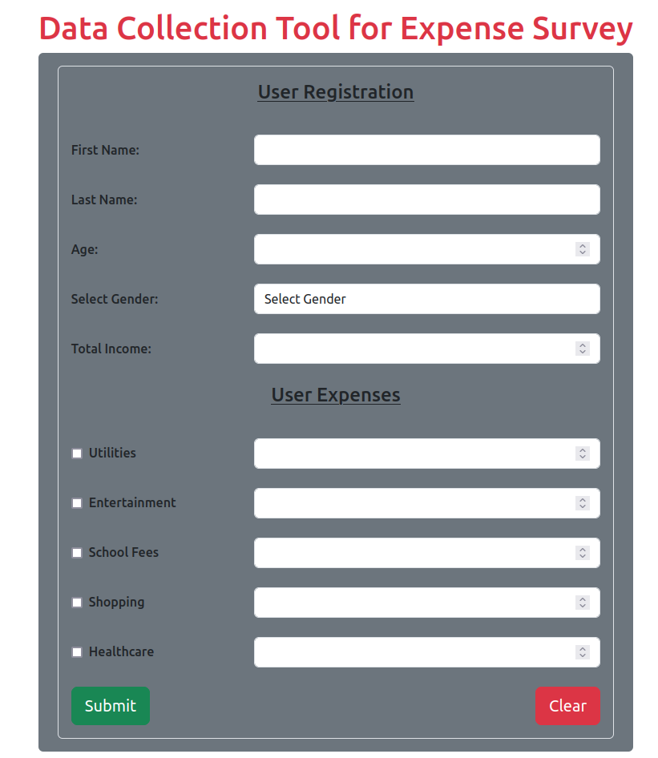
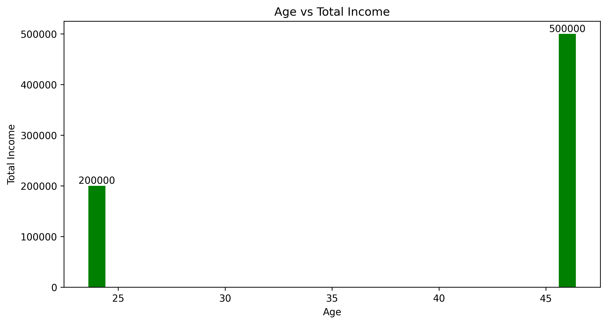
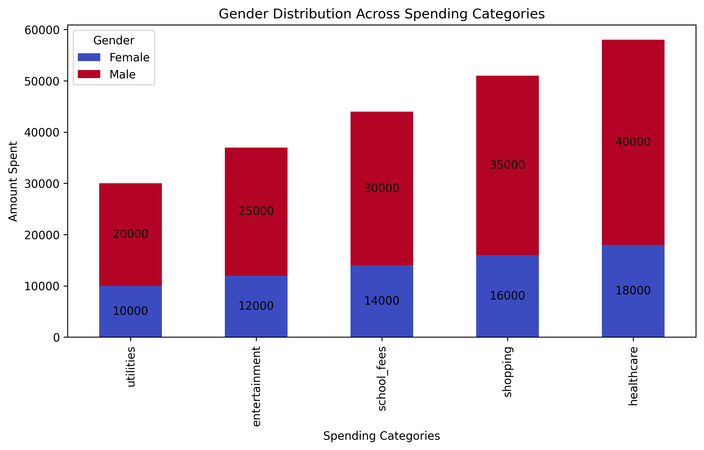

# Final Project Assignment: Flask Healthcare Application

The final project is classfied in two catgories:
- **The Flask Application** - This project is about developing a data collection tool for a survey using the popular Flask webframework. The application was built using MVC(Model-View-Controller). The User intephase was written with HTML and Javascript while database used was MongoDB. The application was hosted on Render.com. The Database was hosted on MongoDM Atlas.

- **The Data Processor** - The Proccessor pulls the records from the database and exports it as a CSV file. The CSV file will now imported into the Jupyter notebook for data analysis and visualization. The charts will now be exported out for use in a powerpoint.

## Key Features for Flask Application

- **Flask Frameworkt**: The application was built using Flaskframework to create APIs and CRUD methods that will serve the application to the web browser.
- **HTML and CSS**: This two stacks where used to model the user page and beuitify the fonts and make the app apealing to use.
- **Javascript**: This stack was used to make the page dynamic and be able to process input and communicate with the APIs.
- **MongoDB Atlas**: The database of the app was hosted on MongoDB Atlas.
- **Render.com**: The Flask application was hosted on Render.com using CI/CD pipline integration to Github repository.

## Key Features for Data Processor

- **Data Integration**: The user data is pulled directly from the MongodDB Atlas and exported as a CSV.
- **Data Visualization**: The data analysis was visualized showig the ages with the highest income and gender distribution across spending categories.
- **Data Export**: The charts of the two analysis was exported out an can be used for powerpoint presentations

- **Error Handling**: Added Error Handling to track any exception and print the error as a string or character.
- **Lanuguage Stack**: The program is written with
    - Python
    - Javascript
    - HTML
    - CSS

## GitHub Repository
1. https://github.com/Onyedikachi-E/survey_expense_application

## How To Use The Program
- **For Python**
1. The app has been hosted on Render and be accessed using this link https://survey-expense-application.onrender.com/

- The User Page for data collection: Enter the details of each user and click on submit to push the data to the MongoDB Atlas.

2. Load the neccessary packages that will be used in the program

3. Run the cell blocks step by step to perform the different sets of operation and export the charts.
- The graph of the ages with the highest income 

- The graph of gender distribution across spending categories
